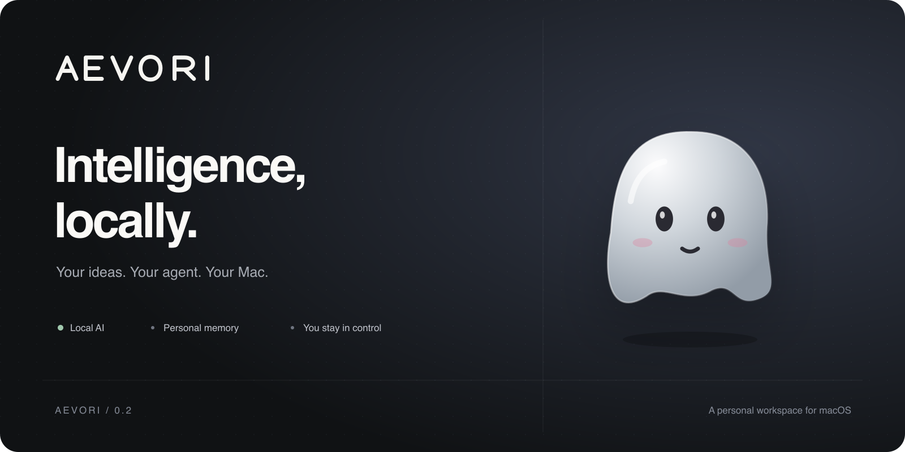
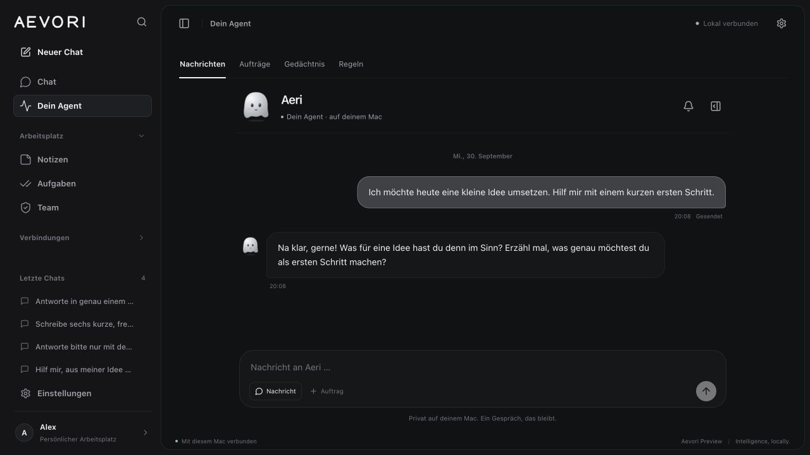

<p align="center"></p>

<p align="center">
  <a href="https://github.com/Stxqq/aevori-app/releases/tag/v0.2.0">Download for macOS</a> ·
  <a href="#get-started">Get started</a> ·
  <a href="#your-workspace">Features</a> ·
  <a href="docs/PUBLICATION.md">Release review</a>
</p>

# Your own little corner of intelligence.

AEVORI is a personal AI workspace that runs on your Mac and opens in your browser.
Chat with local models, give your agent a character, save useful memories and turn
ideas into notes and tasks. Smooth, quiet interactions. Your decisions stay yours.

**Preview 0.2.0 · macOS · Local Ollama inference · German interface**

## Get started

| Mac | Ready-to-run download |
| --- | --- |
| Apple silicon — M1, M2, M3, M4 or newer | [Download AEVORI for Apple silicon](https://github.com/Stxqq/aevori-app/releases/download/v0.2.0/AEVORI-0.2.0-macOS-arm64.zip) |
| Intel | [Download AEVORI for Intel](https://github.com/Stxqq/aevori-app/releases/download/v0.2.0/AEVORI-0.2.0-macOS-x64.zip) |

1. Download and unzip. Move the entire **Aevori** folder somewhere permanent.
2. Open **Aevori starten.command**. AEVORI opens at **http://localhost:5190**.
3. Keep its Terminal window open. Press **Control+C** there to stop the app.
4. For local AI, install [Ollama](https://ollama.com/download) and a model, for example `ollama pull gemma3:4b`. Choose it in AEVORI.

The download contains the built web app and Node.js runtime. **No npm, build step,
account or API key is needed for local chat.** Models are installed separately;
choose one that fits your Mac's memory. macOS 11+ is the Node runtime baseline;
model runtimes may require a newer macOS version.

This is an **unsigned preview**, not a signed/notarized native Mac application.
macOS may ask you to review the downloaded launcher in Privacy & Security. Verify
the release and its SHA-256 file before allowing it. The launcher never disables
Gatekeeper or runs a remote installation script.

A download cannot run a server just by clicking a website link. After launching,
[open the local app](http://localhost:5190). AEVORI has no public hosted AI backend.

## Your workspace

- **A conversation that flows.** Streaming text, a compact composer that expands
  on focus, image/text attachments, Markdown, retry and edit. Controls sit below
  replies. Local model selection and stop work without leaving the conversation.
- **An agent with a face.** Four original characters, colors, expressions and
  accessories. Gentle motion respects reduced-motion preferences.
- **Messages, not mystery.** A persistent agent conversation with unread updates,
  reminders and background results. These are in-app messages, not SMS or push
  notifications. The Mac and AEVORI must remain running; overdue reminders arrive
  when the app starts again.
- **Memory under your control.** Add, inspect and delete memories. Turn memory
  off. Per-user rules govern supported actions; proposed notes and tasks require
  approval. This is stored context, not fine-tuning of model weights.
- **A tidy place to work.** Notes, tasks, full-page settings, name editing, guided
  onboarding and dark/light/sand themes.
- **Choose your intelligence.** Ollama locally; optional compatible cloud APIs.
  Muse Spark support uses a Meta API key and a compatible model. It does not
  synchronize a Muse account or import private characters or memories.
- **A small team, your hardware.** Expiring invitations, revocation and isolated
  member workspaces. A Mac pool routes complete requests across connected hosts;
  it does not combine GPU memory.



## On your phone

AEVORI includes a responsive PWA and an add-to-home-screen guide. The phone needs
an authenticated HTTPS route to your running Mac; `localhost` on the phone refers
to the phone itself. Hosting and HTTPS are **not** automatically configured.
See [the team/phone setup](ONLINE.md). No model runs inside the mobile browser.

## Privacy and boundaries

- The server binds to `127.0.0.1`. No network port or tunnel is exposed automatically.
- The downloaded edition saves agent/team state in
  `~/Library/Application Support/Aevori/`. Chat, notes, tasks and images live in
  the browser's local storage/IndexedDB. These stores are **not encrypted by AEVORI**.
- Local agent inference always uses Ollama. Optional cloud chat sends its messages
  and attachments to the provider you select; API keys stay in server memory.
- Browser dictation may use the browser vendor's cloud speech service. Typing and
  Ollama chat do not require that service.
- The agent can propose notes/tasks and send in-app updates. It cannot operate
  your browser, shell, email, payments or arbitrary files.
- A service worker caches only the offline page and an app icon, never API responses.

## Run from source

Requires Node.js 22.13+ (22.23.3 is bundled in the downloadable edition).

```sh
git clone https://github.com/Stxqq/aevori-app.git
cd aevori-app
npm ci
npm run build
npm run start:web
```

For development: `npm run dev`. Validate with `npm test` and `npm run build`.
Source `npm start` uses project-local `.aevori/` state; `start:web` uses Application
Support. Keep the browser origin and state directory consistent when upgrading.

## Release engineering

The release archive uses an explicit file allowlist, checks the official Node
checksum, contains no user data and needs no npm dependencies at runtime.
Build on macOS after `npm ci && npm test && npm run build`:

```sh
node scripts/notices.mjs
npm run release:mac -- arm64
npm run release:mac -- x64
```

Automated tests cover streaming, input validation, image handling, model routing,
member isolation, invitations, memories, policies, agent messages and reminders.
See [the scoped release review](docs/PUBLICATION.md) for what was actually checked
and what still requires real devices or provider accounts.

## License and credits

Original AEVORI code and artwork are [MIT licensed](LICENSE). **Third-party
components retain separate terms**, especially the adapted free
[Efferd app-shell-3](https://efferd.com/blocks/app-shell) block. This is an end-user
application, not a redistributable component library. Credits and retained
notices: [ASSETS.md](ASSETS.md), [THIRD_PARTY_NOTICES.txt](THIRD_PARTY_NOTICES.txt).

AEVORI is an independent project, not affiliated with Apple, Meta or OpenAI.
It does not claim to be Muse, Dots, or an exact copy of another product.
